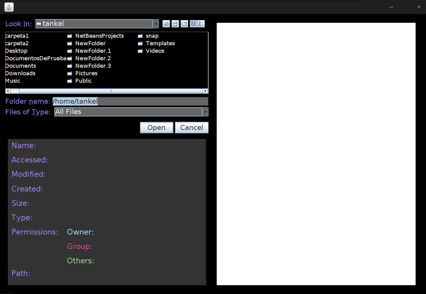
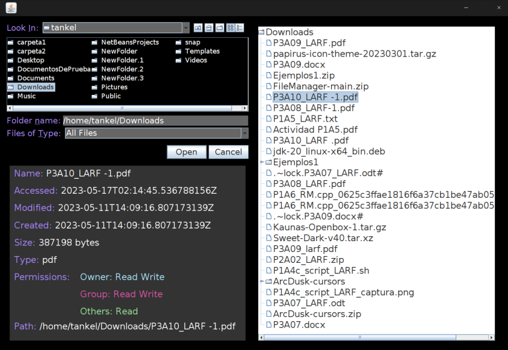
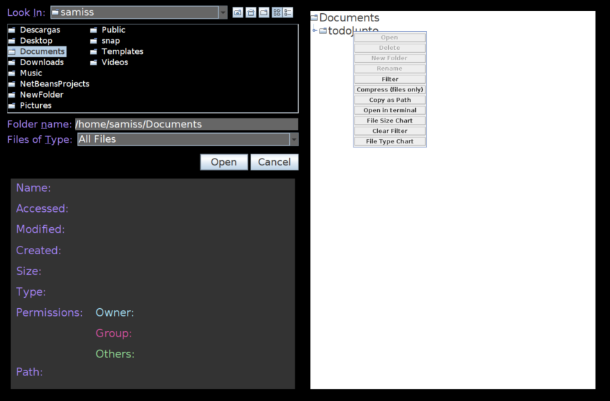
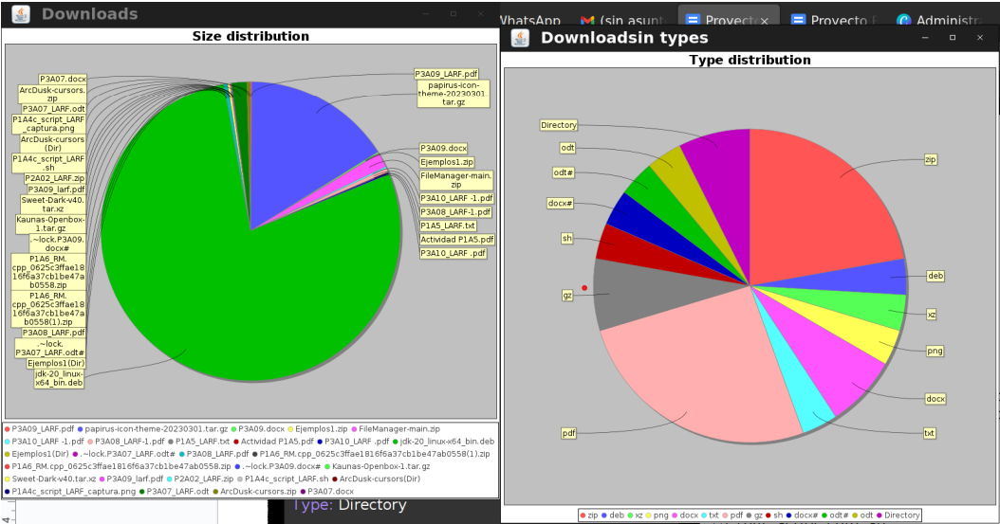

# Linux File Manager

Authors: Luis Ángel Reyes Frausto (@Tankel), Samuel Iván Sánchez Salazar (@SamuelSanchez03)

## Introduction

The Linux File Manager is a final project developed for the Operative Systems class using Java Swing. This project aims to address the challenges faced while managing files and folders using conventional file explorers. Navigating through multiple directories and executing various commands to view file properties or search for specific files can be tedious and time-consuming.

To enhance the file management experience, we have created a user-friendly file manager that presents information in a visually appealing manner. Our file manager utilizes a tree format to display folders, making navigation intuitive and efficient. It incorporates essential features expected from a file manager, such as file compression, folder creation, file opening, and renaming.

## Screens

### Home

Upon launching the application, users are presented with a JFileChooser in the top left corner, allowing them to select the folder they want to manage. The bottom left section displays labels that show the attributes of the selected file(s) once a file is chosen. The right section contains a dynamically updated JTree, enabling users to navigate through the selected folder and perform various functions.

### Folder Selection

After selecting a folder via the JFileChooser, the JTree is updated to display the files and directories within the chosen folder. Users can navigate through the nodes and perform different actions by right-clicking on the JTree. The available actions depend on the number and type of selected files.

### File and Folder Management

When a file is selected, the bottom left labels display various attributes, including name, last access date, last modification date, creation date, size, type, path, and permissions (owner, group, and others). Right-clicking on a file opens a context menu with different options for file manipulation. The enabled buttons vary based on the number or type of selected files.

- Open: Opens the file.
- Delete: Deletes file(s).
- Rename: Renames the file or folder.
- Open in Terminal: Opens the folder in the terminal.
- Copy as Path: Copies the file path.
- New Folder: Creates a new directory within another directory or containing the selected files.
- Filter: Filters or searches based on extension or name.
- Compress (files only): Creates a .zip file containing the selected files. Note that this function works only for files, not directories.
- File Size Chart: Displays a pie chart in a popup window, representing the file size distribution within the folder. The chart is dynamically updated.
- File Type Chart: Displays a pie chart in a popup window, representing the file type distribution within the folder. The chart is dynamically updated.

### Charts

Each chart is updated dynamically, reflecting changes made within or outside the file manager. The size and type distributions help users make informed decisions and efficiently manage their folders. For instance, if a folder occupies a large amount of space, users can easily identify the file causing the high disk usage.
